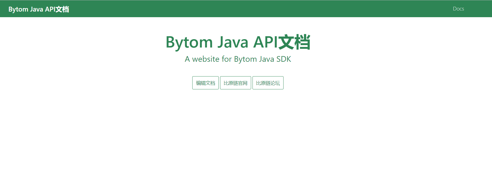

# BytomJava.github.io
此文档介绍了包含[bytom java sdk](<https://github.com/Bytom/bytom-java-sdk>)提供支持的网站配置和文档。

## 入门

### 准备

1. 确保您安装了 [Node](https://nodejs.org/en/download/) （需要8.0或更高的版本）.
   
      > 如果您没有安装 Node 8.2 + ，或是您希望在全局范围内安装 Docusaurus，请运行 `yarn global add docusaurus-init` 或 `npm install --global docusaurus-init`。 安装完成后，运行 `docusaurus-init`。

2. 我们同样建议您也安装 [Yarn](https://yarnpkg.com/en/docs/install) （需要1.5或更高的版本）.

3. 在github上clone项目到本地文件夹，项目中包含两个文件夹： `docs` and `website`.

   ```bash
   git clone https://github.com/BytomFans/java-docs
   ```

### 安装

在根目下运行：

1. `cd website`进入站点的网页部分.
2. `yarn` 安装网页的依赖库 (或者使用命令 `npm install`).

### 本地运行

1. `使用命令 `yarn start` or `npm start`运行网站.
2. 如果没有自动打开本地的示例网站，请在 [http://localhost:3000](http://localhost:3000/) 访问站点.




### 目录结构

```bash
root-directory
├─.circleci
├─docs
└─website
    ├─core
    ├─node_modules
    │  └─.staging
    │      ├─@babel
    │      │  └─types-8cdb7c68
    │      │      └─lib
    │      ├─caniuse-db-2592a44f
    │      │  └─region-usage-json
    │      ├─core-js-34ee6f9c
    │      │  ├─internals
    │      │  ├─modules
    │      │  ├─proposals
    │      │  ├─stable
    │      │  │  ├─array
    │      │  │  │  └─virtual
    │      │  │  ├─array-buffer
    │      │  │  ├─data-view
    │      │  │  ├─date
    │      │  │  ├─dom-collections
    │      │  │  ├─function
    │      │  │  │  └─virtual
    │      │  │  ├─instance
    │      │  │  ├─json
    │      │  │  ├─map
    │      │  │  ├─math
    │      │  │  ├─number
    │      │  │  │  └─virtual
    │      │  │  ├─object
    │      │  │  ├─promise
    │      │  │  ├─reflect
    │      │  │  ├─regexp
    │      │  │  ├─set
    │      │  │  ├─string
    │      │  │  │  └─virtual
    │      │  │  ├─symbol
    │      │  │  ├─typed-array
    │      │  │  ├─url
    │      │  │  ├─url-search-params
    │      │  │  ├─weak-map
    │      │  │  └─weak-set
    │      │  ├─stage
    │      │  └─web
    │      ├─core-js-467a2f2c
    │      │  ├─modules
    │      │  ├─proposals
    │      │  ├─stable
    │      │  │  ├─array
    │      │  │  │  └─virtual
    │      │  │  ├─array-buffer
    │      │  │  ├─data-view
    │      │  │  ├─date
    │      │  │  ├─dom-collections
    │      │  │  ├─function
    │      │  │  │  └─virtual
    │      │  │  ├─instance
    │      │  │  ├─json
    │      │  │  ├─map
    │      │  │  ├─math
    │      │  │  ├─number
    │      │  │  │  └─virtual
    │      │  │  ├─object
    │      │  │  ├─promise
    │      │  │  ├─reflect
    │      │  │  ├─regexp
    │      │  │  ├─set
    │      │  │  ├─string
    │      │  │  │  └─virtual
    │      │  │  ├─symbol
    │      │  │  ├─typed-array
    │      │  │  ├─url
    │      │  │  ├─url-search-params
    │      │  │  ├─weak-map
    │      │  │  └─weak-set
    │      │  ├─stage
    │      │  └─web
    │      ├─core-js-a4423f20
    │      │  ├─library
    │      │  │  └─web
    │      │  ├─modules
    │      │  │  └─library
    │      │  ├─stage
    │      │  └─web
    │      ├─core-js-pure-5c81a11f
    │      │  ├─modules
    │      │  ├─proposals
    │      │  ├─stable
    │      │  │  ├─array
    │      │  │  │  └─virtual
    │      │  │  ├─array-buffer
    │      │  │  ├─data-view
    │      │  │  ├─date
    │      │  │  ├─dom-collections
    │      │  │  ├─function
    │      │  │  │  └─virtual
    │      │  │  ├─instance
    │      │  │  ├─json
    │      │  │  ├─map
    │      │  │  ├─math
    │      │  │  ├─number
    │      │  │  │  └─virtual
    │      │  │  ├─object
    │      │  │  ├─promise
    │      │  │  ├─reflect
    │      │  │  ├─regexp
    │      │  │  ├─set
    │      │  │  ├─string
    │      │  │  │  └─virtual
    │      │  │  ├─symbol
    │      │  │  ├─typed-array
    │      │  │  ├─url
    │      │  │  ├─url-search-params
    │      │  │  ├─weak-map
    │      │  │  └─weak-set
    │      │  ├─stage
    │      │  └─web
    │      ├─prismjs-64053c3e
    │      │  └─components
    │      ├─remarkable-daec167c
    │      │  └─dist
    │      └─send-c6c87478
    ├─pages
    │  └─en
    └─static
        ├─css
        └─img
```
